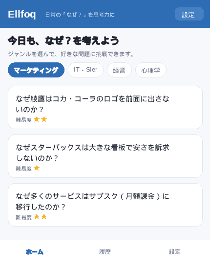
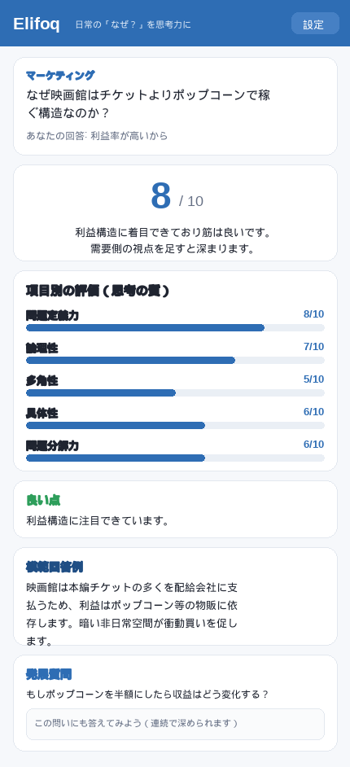

<p align="center">
  
</p>

<h1 align="center">Elifoq（エリフォク）</h1>

<p align="center">
  <b>Everyday Life Is Full Of Questions</b><br>
  日常の「なぜ？」に答えると、AIが正解判定をせずに視点を広げてくれる思考力トレーニングアプリ
</p>

<p align="center">
  <a href="https://anjukoseki-creator.github.io/elifoq/">
    
  </a>
</p>

<p align="center">
  
  
  
  
  
  
</p>

---

## ▶ 触ってみる

**[https://anjukoseki-creator.github.io/elifoq/](https://anjukoseki-creator.github.io/elifoq/)**

設定画面で自分の Claude（Anthropic）APIキーを登録すると、実際に AI が採点・フィードバックを返します。インストール不要、スマホでもPCでもそのまま動きます。

> ⚠️ Anthropic API には無料枠がありません。利用には事前に [Anthropic Console](https://console.anthropic.com/settings/billing) でクレジット（最低 $5 程度）の購入が必要です。使用モデルは低コストの **Claude Haiku 4.5** です。

## 📱 画面

<p align="center">
  
  &nbsp;&nbsp;&nbsp;
  
</p>

<p align="center"><sub>左：ジャンルから問題を選ぶ　／　右：8項目の採点・別視点・模範回答・発展質問</sub></p>

## 🎯 コンセプト

身近な「なぜ？」に自分なりの答えを書くと、AIが **正解判定をせず** に視点を広げて返してくれる。
クイズアプリが「正解を覚える」のに対し、Elifoqは「**考え方を学ぶ**」ことに特化しています。

| | 一般的なクイズアプリ | **Elifoq** |
|---|---|---|
| ゴール | 正解を覚える | 考え方の幅を増やす |
| AIの役割 | 採点して終わり | 視点を広げるコーチ |
| 体験 | ○×が出る | 別の切り口・模範回答・発展質問が返る |

就活のケース面接対策・ロジカルシンキングの習慣化を主なターゲットにしています。

## ✨ 主な機能

- **ジャンル別 問題集（全12ジャンル・180問）** — 好きな問題に何問でも挑戦できる。
  マーケティング / IT・SIer / 自社開発 / 経営 / 心理学 / 社会 / 身近な謎 / 科学・テクノロジー / 歴史 / お金・投資 / 働き方・キャリア / キャリアコンサルタント（各15問）。
- **8項目の思考採点（10点満点）** — 問題定義力・論理性・多角性・具体性・問題分解力・仮説を立てる力・数字感覚・創造力を、それぞれスコアと講評で可視化。
- **模範回答例** — 筋の良い回答例を提示。
- **発展質問に連続回答** — 返ってきた問いにそのまま答えて、思考をさらに深掘りできる。
- **続けたくなる仕掛け（ゲーミフィケーション）**
  - 🔥 **連続日数・のべ回答数・平均点** をホームにひと目で表示
  - 🏅 **レベル称号**（はじめの一歩 → かけだし思考家 → 一人前の思考家 → 思考マスター → 思考の達人）
  - 🎯 **今日の一問** — 日替わりでおすすめ問題を提案
  - ✅ **挑戦済みマーク & ジャンル別進捗**（◯/15問クリア）
  - 💬 採点後の **励ましメッセージ**
- **思考履歴** — 過去の回答とフィードバックを端末に保存して振り返り。
- **スマホ / PC 両対応** — レスポンシブ設計。PCでは問題を2列グリッドで表示。
- **BYOK（Bring Your Own Key）** — ユーザー自身の Claude APIキーで動作。鍵はブラウザ内にのみ保存し、外部サーバーには一切送らない。

## 🏗 仕組み

```
ブラウザ（Elifoq / 単一HTML）
   ├─ APIキーは localStorage に保存（外部サーバーへは送信しない）
   └─ ユーザーのキーで Anthropic Messages API を直接呼ぶ
        → Claude Haiku 4.5 が構造化JSON（output_config.format）で
          8項目採点・別視点・模範回答・発展質問を返す
```

- **バックエンドなし** — GitHub Pages 上の静的な単一HTMLだけで完結。サーバー費ゼロ。
- **BYOK設計** — 共有キーを埋め込まないため「鍵流出で高額請求」のリスクがない。鍵は各ユーザー自身のもので、`anthropic-dangerous-direct-browser-access` によりブラウザから直接APIを呼ぶ。
- **コスト** — Anthropic は無料枠なし（事前クレジット購入が必要）。Claude Haiku 4.5 は低コストのため、1回の採点はごくわずかな費用で利用できる。

## 🧰 技術スタック

| 項目 | 採用 |
|---|---|
| フロント | Vanilla JavaScript（単一 `index.html`、依存ライブラリなし） |
| AI | Anthropic Claude API（`claude-haiku-4-5`、`output_config.format` の JSON Schema で構造化出力） |
| 鍵・履歴・進捗の保存 | localStorage |
| ホスティング | GitHub Pages |
| レイアウト | レスポンシブ（スマホ縦 / PC 2列グリッド） |
| PWA | manifest + アイコン（ホーム画面に追加可能） |

## 🚀 ローカルで動かす

```bash
git clone https://github.com/anjukoseki-creator/elifoq.git
cd elifoq
# index.html をブラウザで開くだけ。ビルド不要。
```

起動後、設定画面で [Anthropic Console](https://console.anthropic.com/settings/keys) で作成したAPIキー（`sk-ant-…`）を登録してください。あらかじめ [Billing](https://console.anthropic.com/settings/billing) でクレジットの購入が必要です。

## 🗺 ロードマップ

- [x] ジャンル別問題集（12ジャンル・180問）
- [x] 8項目の思考採点・模範回答・発展質問への連続回答
- [x] 思考履歴 / BYOK / アプリアイコン
- [x] 継続の仕掛け（連続日数・レベル・今日の一問・進捗・励まし）
- [x] スマホ / PC 両対応（レスポンシブ）
- [ ] 視点コレクション（使った視点を図鑑のように収集）
- [ ] 思考レーダーチャート（ジャンル別の傾向を可視化）
- [ ] みんなの回答（匿名公開）

## 📄 ライセンス

MIT License — [LICENSE](LICENSE)

---

<p align="center"><sub>個人開発のポートフォリオ作品です。</sub></p>
